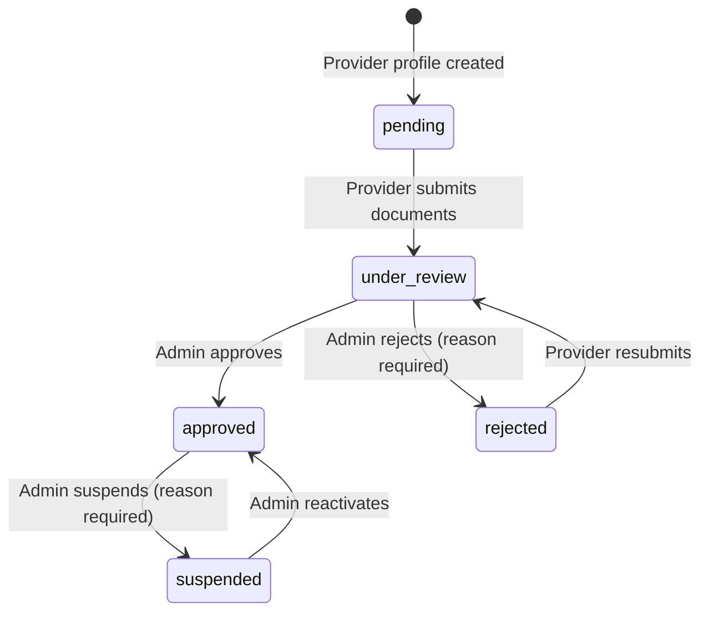

# Data Model: Provider Verification System

## Entity: ProviderVerification

**Table**: `provider_verifications`
**Schema**: Represents a provider's verification application and its lifecycle.

### Fields

| Field | Type | Constraints | Description |
|-------|------|-------------|-------------|
| id | UUID | PK, default: `uuid_generate_v4()` | Primary identifier |
| providerId | UUID | FK → `provider_profiles.id`, NOT NULL, UNIQUE | The provider being verified (1:1 with provider) |
| status | String | NOT NULL, default: `'pending'` | Current verification status (pending, under_review, approved, rejected, suspended) |
| rejectionReason | Text | NULLABLE | Reason provided when rejected |
| suspensionReason | Text | NULLABLE | Reason provided when suspended |
| submittedAt | Timestamp | NULLABLE | When the provider submitted their verification |
| reviewedAt | Timestamp | NULLABLE | When an admin last reviewed this application |
| reviewedBy | UUID | NULLABLE, FK → `users.id` | Admin who performed the last review action |
| createdAt | Timestamp | NOT NULL, default: now() | Record creation timestamp |
| updatedAt | Timestamp | NOT NULL, onUpdate: now() | Record last update timestamp |

### Indexes

- `@Index(['providerId'])` — fast lookup by provider
- `@Index(['status'])` — filter by status in admin listing
- `@Index(['submittedAt'])` — sort/filter by submission date
- `@Index(['reviewedBy'])` — find actions by admin

### Relationships

- **1:1** with `ProviderProfile` (via `providerId`)
- **1:M** with `VerificationDocument` (via `verificationId`)
- **1:M** with `VerificationHistory` (via `verificationId`)

---

## Entity: VerificationDocument

**Table**: `verification_documents`
**Schema**: A file uploaded by a provider as evidence for verification.

### Fields

| Field | Type | Constraints | Description |
|-------|------|-------------|-------------|
| id | UUID | PK, default: `uuid_generate_v4()` | Primary identifier |
| verificationId | UUID | FK → `provider_verifications.id`, NOT NULL | Parent verification record |
| documentType | String | NOT NULL | Type of document (national_id, passport, driver_license, professional_license, commercial_registration) |
| documentUrl | String | NOT NULL | Storage URL/path to the document file |
| originalName | String | NULLABLE | Original filename for display |
| mimeType | String | NULLABLE | File MIME type |
| fileSize | Integer | NULLABLE | File size in bytes |
| uploadedAt | Timestamp | NOT NULL, default: now() | When the document was uploaded |
| createdAt | Timestamp | NOT NULL, default: now() | Record creation timestamp |

### Indexes

- `@Index(['verificationId'])` — fast lookup by verification
- `@Index(['documentType'])` — filter by document type

### Relationships

- **M:1** with `ProviderVerification` (via `verificationId`)

---

## Entity: VerificationHistory

**Table**: `verification_history`
**Schema**: Immutable audit trail of all status changes on a verification record.

### Fields

| Field | Type | Constraints | Description |
|-------|------|-------------|-------------|
| id | UUID | PK, default: `uuid_generate_v4()` | Primary identifier |
| verificationId | UUID | FK → `provider_verifications.id`, NOT NULL | Parent verification record |
| oldStatus | String | NULLABLE | Previous status before this change (null for initial creation) |
| newStatus | String | NOT NULL | Status after this change |
| changedBy | UUID | NOT NULL, FK → `users.id` | User who performed the change |
| changedByRole | String | NOT NULL | Role of the changer (provider, admin) |
| notes | Text | NULLABLE | Optional notes about the change |
| createdAt | Timestamp | NOT NULL, default: now() | When the change occurred |

### Indexes

- `@Index(['verificationId'])` — fast lookup by verification
- `@Index(['changedBy'])` — find actions by user
- `@Index(['createdAt'])` — chronological ordering

### Constraints

- **Append-only**: No UPDATE or DELETE operations allowed on this table.
- **Immutable**: Once written, records must never be modified.

### Relationships

- **M:1** with `ProviderVerification` (via `verificationId`)

---

## Verification Status State Machine



### Allowed Transitions

| Current Status | Next Status | Actor | Conditions |
|---------------|-------------|-------|------------|
| pending | under_review | Provider | Required documents uploaded |
| under_review | approved | Admin | None |
| under_review | rejected | Admin | Rejection reason required |
| rejected | under_review | Provider | New documents uploaded |
| approved | suspended | Admin | Suspension reason required |
| suspended | approved | Admin | None |

---

## Entity Relationship Diagram

```text
ProviderProfile (1) ─────── (1) ProviderVerification
                                      │
                         ┌────────────┼────────────┐
                         │            │            │
                    (1:M)         (1:M)         (1:M)
                         │            │            │
                    Verification  Verification  AuditLog
                    Documents     History       (via audit service)
```

- `ProviderProfile` has one `ProviderVerification`
- `ProviderVerification` has many `VerificationDocument` records
- `ProviderVerification` has many `VerificationHistory` records
- Admin actions are additionally logged to the shared `AuditLog` table

---

## Validation Rules

### ProviderVerification
- `providerId`: Must reference an existing provider profile.
- `status`: Must be one of: pending, under_review, approved, rejected, suspended.
- Transitions: Must follow the state machine above; invalid transitions rejected.

### VerificationDocument
- `verificationId`: Must reference an existing verification record.
- `documentType`: Must be one of: national_id, passport, driver_license, professional_license, commercial_registration.
- `documentUrl`: Must be a valid URL or path string.
- At least one identity document (national_id or passport) required before submission.
- File validation: jpg, jpeg, png, pdf only; max 10MB.

### VerificationHistory (append-only)
- No UPDATE or DELETE allowed.
- `newStatus` required.
- `changedBy` required.

---

## Document Types Enum

```typescript
enum DocumentType {
  NATIONAL_ID = 'national_id',
  PASSPORT = 'passport',
  DRIVER_LICENSE = 'driver_license',
  PROFESSIONAL_LICENSE = 'professional_license',
  COMMERCIAL_REGISTRATION = 'commercial_registration',
}
```

## Verification Status Enum

```typescript
enum VerificationStatus {
  PENDING = 'pending',
  UNDER_REVIEW = 'under_review',
  APPROVED = 'approved',
  REJECTED = 'rejected',
  SUSPENDED = 'suspended',
}
```
